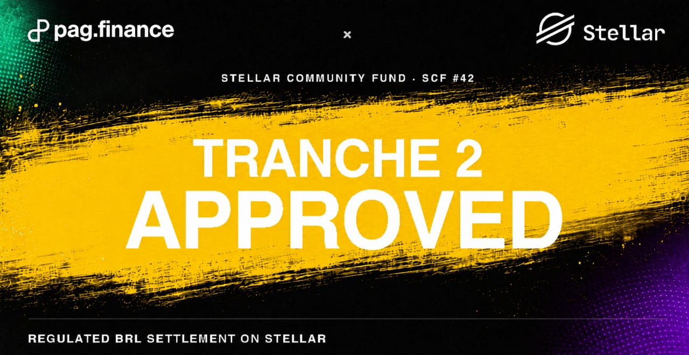
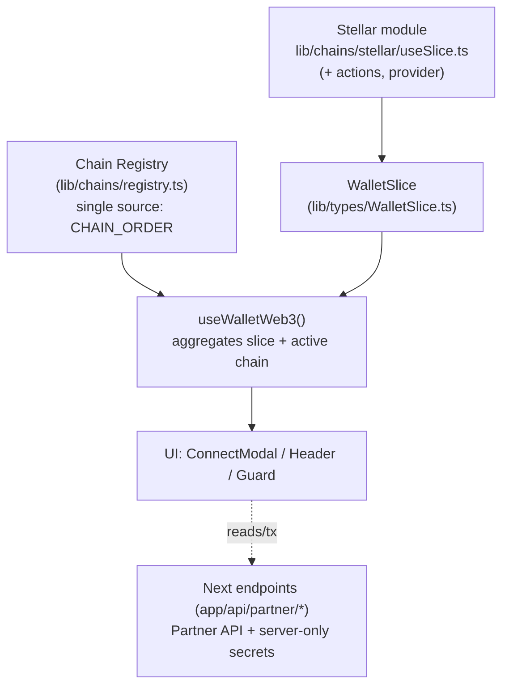

<p align="center">
  
</p>

## 🔑 Onboarding: como gerar sua chave de API

Para usar a **Partner API da PagFinance** (cash-in, cash-out e KYC-KYB) você precisa de uma chave de
API. A chave é emitida pelo time da PagFinance após o cadastro da sua empresa - ela **não é gerada
localmente por este scaffold**.

**Solicite a sua chave em 👉 [https://pag.finance/pt/businesses](https://pag.finance/pt/businesses)**

Passo a passo:

1. Acesse **[https://pag.finance/pt/businesses](https://pag.finance/pt/businesses)** e faça o cadastro
   da sua empresa (onboarding de _businesses_).
2. Complete a verificação (KYC-KYB) solicitada durante o onboarding.
3. Após a aprovação, você recebe as credenciais da Partner API: **`PARTNER_ID`** e o segredo HMAC
   **`PARTNER_RAW_SECRET`** (mais os `PARTNER_APP_*` quando aplicável).
4. Copie `.env.example` para `.env.local` e preencha essas variáveis - veja a seção
   [**Run it**](#run-it) e a referência completa em
   [`docs/06-environment-variables.md`](docs/06-environment-variables.md).

> ⚠️ A chave é um segredo: mantenha-a **apenas no servidor** (`.env.local`, nunca em código de
> cliente ou commitada). Sem `PARTNER_*` configurado, os fluxos da Partner API respondem `503`.

> **Tranche 2 aprovada - Stellar Community Fund (SCF #42).** A segunda parcela do grant da
> PagFinance no Stellar Community Fund foi aprovada. O foco do trabalho financiado é a
> **liquidação de BRL regulado sobre a rede Stellar** - a fundação técnica que este scaffold
> ajuda a sustentar (integração de carteiras Stellar e a Partner API de cash-in / cash-out / KYC).
> O banner acima é o material de anúncio da parceria pag.finance × Stellar.

# Stellar Ramp Scaffold

[](https://nextjs.org)
[](https://react.dev)
[](https://typescriptlang.org)
[](https://stellar.org)
[](https://tanstack.com/query)
[](https://vitest.dev)
[](https://nodejs.org)
[](LICENSE)

A **Stellar-exclusive** wallet-connector scaffold (Next.js 15, App Router) - a base for on/off-ramp
apps on the Stellar network, ready to be ported into the PagFinance webapp. Every wallet resolves to
a single signing abstraction, `WalletSlice` (`lib/types/WalletSlice.ts`), aggregated by
`hooks/useWalletWeb3.ts`, so the rest of the app never branches on *who* produced a signature.

**Stack:**
- **Stellar wallets:** [Stellar Wallets Kit](https://github.com/Creit-Tech/Stellar-Wallets-Kit)
  (Freighter, Lobstr, xBull, Hana, Albedo) via a single provider/modal.
- **Transactions:** `@stellar/stellar-sdk` (Horizon) - payments built and signed client-side from the
  Partner-API-authoritative `receiver` / `amount` / `memo`.

It also ships a **PagFinance Partner API** integration (`app/api/partner/*`) for cash-in / cash-out /
KYC-KYB, where all secrets stay server-side.

## Run it

First fill in `.env.local` (see `.env.example`). Start with the two that change behaviour:

| Var | Required in prod | Effect if missing |
|-----|------------------|-------------------|
| `APP_SESSION_SECRET` (≥16 chars) | **Yes** | Cash-in/out routes fall back to legacy mode and trust the client-supplied `sender` → IDOR (BUG-H3). The preflight (`instrumentation.ts`) blocks the boot when `NODE_ENV=production`. |
| `PARTNER_*` (`PARTNER_ID`, `PARTNER_RAW_SECRET`, `PARTNER_API_BASE_URL`, `PARTNER_APP_*`) | No (but the flows answer `503`) | Partner API reported as "não configurada" - cash-in/out/KYC unavailable. |

Stellar network selection is via `NEXT_PUBLIC_STELLAR_NETWORK` (`PUBLIC` / `TESTNET`) and
`NEXT_PUBLIC_STELLAR_HORIZON_URL`. Full reference:
[`docs/06-environment-variables.md`](docs/06-environment-variables.md).

Then you may run the scaffold locally:

```bash
npm i
cp .env.example .env.local
npm run dev            # http://localhost:3000
```

Scripts: `npm run typecheck` · `npm run lint` · `npm run test` · `npm run build`.
Pre-PR / CI gate: `typecheck → lint → test → build`.

## Documentation

For contributors and AI agents, the authoritative docs live under **[`docs/`](docs/)** and are
indexed by **[`CLAUDE.md`](CLAUDE.md)**. Start with
[`docs/00-overview-and-architecture.md`](docs/00-overview-and-architecture.md), then:

| # | Title | Topic |
|---|-------|-------|
| [`00`](docs/00-overview-and-architecture.md) | **Overview & Architecture** | Stack, `WalletSlice`, chain registry, layering, providers, commands, env. Start here. |
| [`01`](docs/01-chains-and-wallets.md) | **Chains & Wallets** | Registry, the Stellar `useSlice`, actions, exclusivity guard |
| [`02`](docs/02-actions-and-interpreter.md) | **Actions & Interpreter** | Partner-API-built instruction (`useCashout`), the transfer dispatch |
| [`03`](docs/03-server-api-and-security.md) | **Server API & Security** | `app/api/*`, CORS, rate-limit, session token, `server-only` |
| [`04`](docs/04-partner-api.md) | **Partner API** | HMAC, user-JWT, cash-in/out, KYC-KYB |
| [`06`](docs/06-environment-variables.md) | **Environment Variables** | Full env reference: every var, required-or-not, defaults, "minimum to run in production" checklist |
| [`known-issues`](docs/known-issues.md) | **Known Issues** | Audited pre-existing bugs and hardening gaps; read before touching a subsystem |

## Architecture (in one picture)



License: MIT
